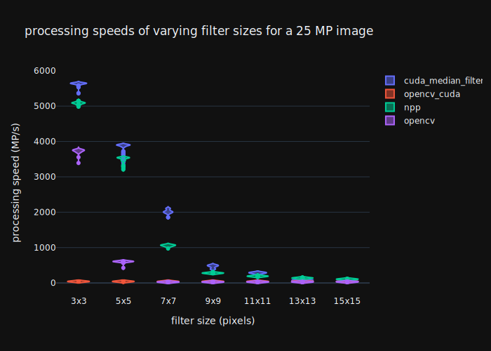

# cuda_median_filter

`cuda_median_filter` is a [median filter](https://en.wikipedia.org/wiki/Median_filter) implementation for the CUDA platform.

A median filter may be used to remove salt and pepper noise from an image:


 

(image courtesy: https://www.publicdomainpictures.net/en/view-image.php?image=197897&picture=reporter-camera)

As opposed to other well-known image filters, the median filter is non-linear and thus not separable. The computationally expensive part of the filter operation is to find the median element in the local neighborhood of a pixel. In order to achieve high throughput, the median filter implementation in this repo performs the sorting using fully compile time generated [Sorting Networks](https://en.wikipedia.org/wiki/Sorting_network). 
Sorting networks may perform more comparison and swap operations than "classical" sorting algorithms in terms of big-O notation, sorting networks will result in zero branch divergence however, which makes them a perfect match for SIMT execution. 

In case of a 8-bit grayscale pixel format, sorting will additionally be vectorized using CUDA SIMD intrinsics effectively letting each thread process four pixels each. 

## Usage

The library is a header-only library, the benchmark program, CLI app and tests may however be compiled using CMake.
To be able to use the median filters, the folder `deps/SortingNetworkCpp/include` has to be added to the header include paths.
Due to heavy constexpr and template usage, code making use of `cuda_median_filter` has to be compiled with `--expt-relaxed-constexpr` and depening on the used filter size also with `-ftemplate-depth 512` (where 512 probably may also replaced with smaller values).

Usage of the filter is straightforward. The templated function `quxflux::median_2d_async` has to be specialized for a value type and a filter size, e.g. `quxflux::median_2d_async<std::uint8_t, 3>` for a 3 x 3 8bit median filter. `quxflux::median_2d_async` is overloaded to either accept a linear device buffer or a `cudaTextureObject_t`. A `cudaStream_t` may be optionally provided:
```cpp
#include <cuda_median_filter/cuda_median_filter.h>

// usage with raw device memory
void median_7x7_u8(const void* const input_dev_ptr,
                   const std::int32_t input_row_pitch,
                   void* const output_dev_ptr,
                   const std::int32_t output_row_pitch,
                   const std::int32_t width, const std::int32_t height,
                   const cudaStream_t stream)

{
  quxflux::median_2d_async<std::uint8_t, 7>(input_dev_ptr, input_row_pitch, output_dev_ptr, output_row_pitch, width, height, stream);
}

// usage with texture object
void median_7x7_u8(const cudaTextureObject_t tex,
                   void* const output_dev_ptr,
                   const std::int32_t output_row_pitch,
                   const std::int32_t width, const std::int32_t height,
                   const cudaStream_t stream)

{
  quxflux::median_2d_async<std::uint8_t, 7>(tex, output_dev_ptr, output_row_pitch, width, height, stream);
}
// ...
```

## Dependencies / Requirements

### general
* CUDA 11.6 (older versions may work as well)
* Nvidia GPU with compute capability 61 or higher (GPUs with a lower compute capability version may work as well) 
* [SortingNetworkCpp](https://github.com/quxflux/SortingNetworkCpp) (contained as submodule)

### tests
* [metal](https://github.com/brunocodutra/metal) (contained as submodule)

### benchmark
* [metal](https://github.com/brunocodutra/metal) (contained as submodule)
* optional; dependency is needed when the according option is enabled in the CMake project:
  * [OpenCV](https://github.com/opencv/opencv) (OpenCV CPU median filter implementation)
  * [OpenCV Contrib](https://github.com/opencv/opencv_contrib) (OpenCV CUDA median filter implementation)
  * [NVIDIA Performance Primitives](https://developer.nvidia.com/npp)

## Limitations

* no ROI support
* anchor is always centered in filter mask
* only single channel images are supported

## Results

Figures in these section show [violin plots](https://en.wikipedia.org/wiki/Violin_plot) of processing speeds (100 runs for each implementation, each run including memory transfers from host to device and device to host). All benchmarks have been performed with following hardware configuration (running Ubuntu 20.04 LTS):
* AMD Ryzen 7 2700X
* NVIDIA GeForce GTX 1080
* 32 GiB RAM

The proposed sorting network based CUDA median filter implementation shows significant performance improvements in comparison to other state-of-the-art image processing libraries for small filter sizes. For larger filter sizes (> 11x11 Pixels) higher register pressure slows down the processing for the proposed algorithm:



## Open topics

* check whether vectorized processing of two pixels in one thread via `__half2` intrinsics can speed up processing (probably stored in shared mem)

## Acknowledgements

* [metal](https://github.com/brunocodutra/metal) for test case and benchmark generation
* [Jason Turners C++ Starter Project](https://github.com/cpp-best-practices/cpp_starter_project)
* plots generated with [Plotly Graphing Libraries](https://plotly.com/graphing-libraries/)

## License

[GPLv3](LICENSE)
